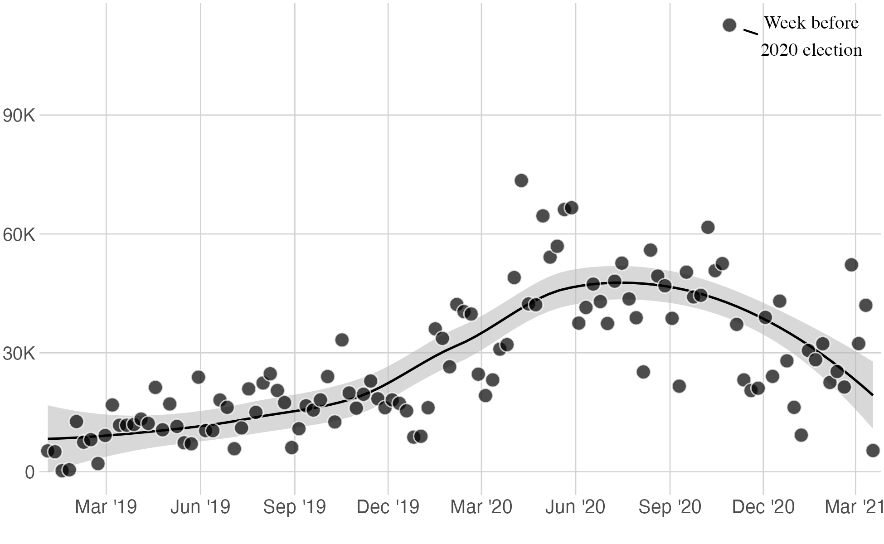
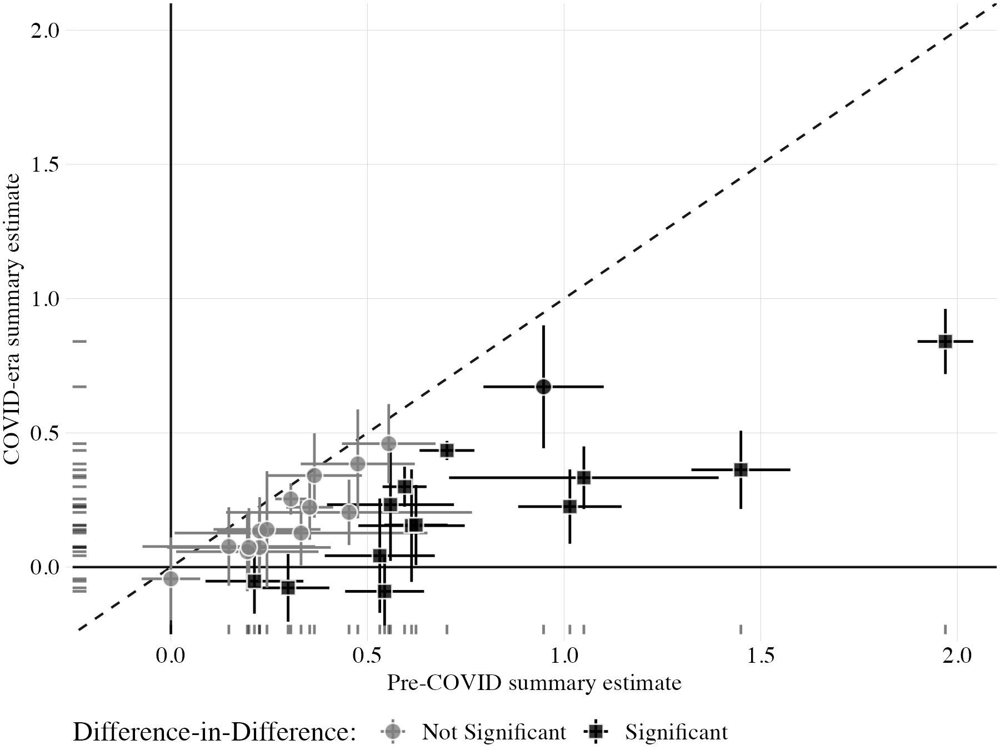
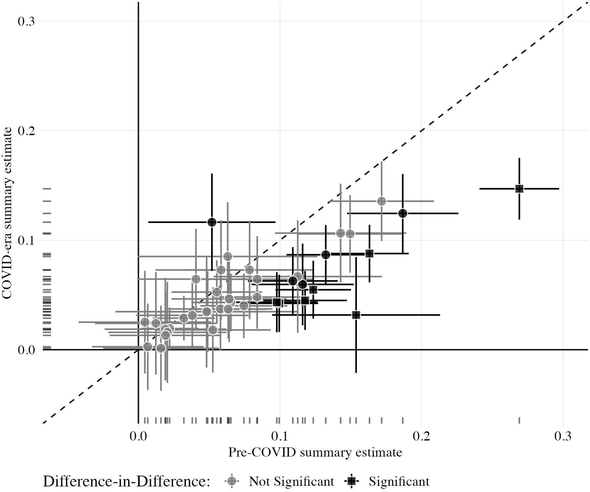
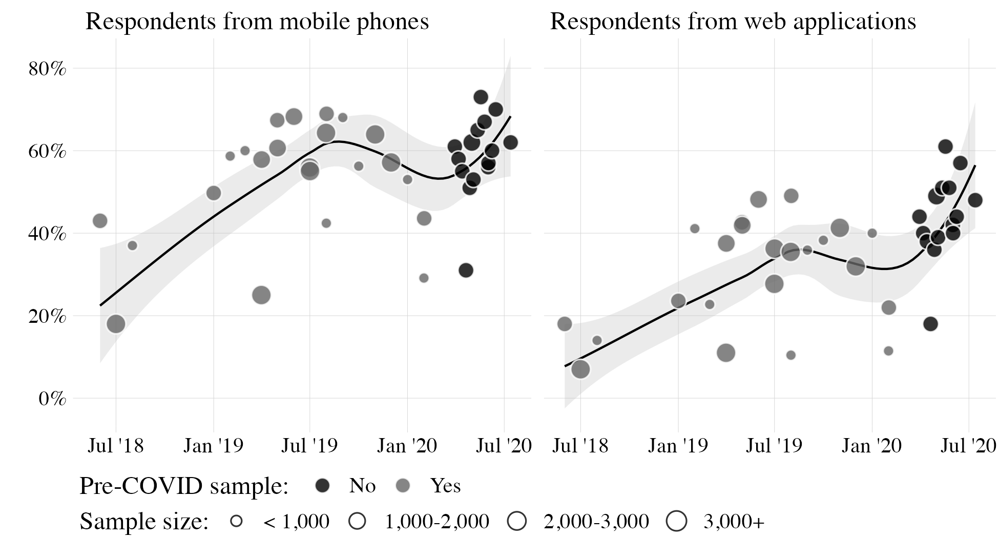
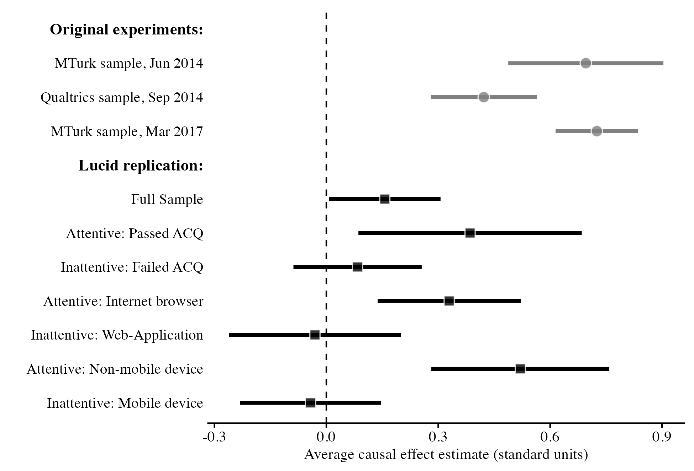

# Active Maintenance Report: peyton_huber_coppock_2022


- [Paper overview](#paper-overview)
- [Summary](#summary)
  - [Does the deposited archive run?](#does-the-deposited-archive-run)
  - [Does the maintained rewrite reproduce the
    paper?](#does-the-maintained-rewrite-reproduce-the-paper)
- [Original archive reproducibility](#original-archive-reproducibility)
- [Errata](#errata)
  - [Corrected p-value adjustment (published article, Figures 2 and 3
    and page
    6)](#corrected-p-value-adjustment-published-article-figures-2-and-3-and-page-6)
  - [A rounding difference in Table
    2](#a-rounding-difference-in-table-2)
- [Number-by-number comparison](#number-by-number-comparison)
- [Maintained rewrite](#maintained-rewrite)
  - [Architecture](#architecture)
  - [Deprecated patterns replaced](#deprecated-patterns-replaced)
- [Fixed-effect and random-effects
  pooling](#fixed-effect-and-random-effects-pooling)
- [Figures](#figures)
- [Table 2](#table-2)
- [Maintained rewrite verification](#maintained-rewrite-verification)
- [R environment](#r-environment)

This repository holds the actively maintained replication code for
Peyton, Huber and Coppock (2022), together with the reproducibility
report that documents what the original archive did and did not do. It
is part of a program applying the maintenance proposal in Peer, Orr and
Coppock (2021, *PS: Political Science & Politics*, doi
[10.1017/S1049096521000366](https://doi.org/10.1017/S1049096521000366))
to a set of published archives.

|  |  |
|----|----|
| Article | [10.1017/xps.2021.17](https://doi.org/10.1017/xps.2021.17) |
| Corrigendum | [10.1017/xps.2022.23](https://doi.org/10.1017/xps.2022.23) |
| Replication archive | [10.7910/DVN/38UTBF](https://doi.org/10.7910/DVN/38UTBF) |

**The data are not redistributed here.** The deposit is 93 MB across 20
files and lives at Harvard Dataverse, which is the only copy this
repository points at. `download_original.R` fetches it and verifies
every file; `original_manifest.csv` pins the file identifiers, sizes and
checksums, so the exact bytes this code was written against are recorded
in version control even though the bytes themselves are not.

**Repository layout.** `maintained/` is the maintained rewrite: one
script per published figure or table, writing to `output/`, which is
committed so a reader can compare a fresh run against it without
downloading anything. `ground_truth/` ties every published number to the
code that produces it. `original/` is created by the download script and
is deliberately absent from the repository. This README is the
reproducibility report, also available as a PDF in `report/`.

**License.** CC0 1.0 Universal, matching the terms of the deposit this
repository maintains. See `LICENSE`.

**To reproduce.** Clone or download the repository, open
`peyton_huber_coppock_2022.Rproj`, and run:

``` r
source("run_all.R")
```

That fetches the deposit, verifies its 20 files, and produces every
figure and table into `maintained/output/`. Required packages:
tidyverse, estimatr, metafor, ggthemes, ggrepel, ggforce, lemon, RCurl,
haven, xtable, knitr, kableExtra, here. Paths resolve through `here`, so
nothing depends on the working directory. The run also needs network
access beyond Dataverse, because the deposited appendix code downloads
two ManyLabs 2 datasets from GitHub. A successful run overwrites
`maintained/output/`, which is committed: **`git diff` on that folder is
the reproduction check.**

# Paper overview

**Citation**: Peyton, K., Huber, G. A. and Coppock, A. (2022). “The
Generalizability of Online Experiments Conducted During the COVID-19
Pandemic.” *Journal of Experimental Political Science*, 9(3), 379-394.
DOI: 10.1017/xps.2021.17

**Corrigendum**: Peyton, K., Huber, G. A. and Coppock, A. (2023).
*Journal of Experimental Political Science*, 10(2), 306-309. DOI:
10.1017/xps.2022.23

**Summary**: The paper asks whether survey experiments fielded during
the COVID-19 pandemic recover what the same designs found before it. The
authors fielded 33 replications of 12 previously published designs
across 13 weekly Lucid quota samples of roughly 1,000 US respondents
each, between March and July 2020, spanning binary, ordinal, six-arm and
factorial conjoint designs. Pre-COVID benchmarks come from the original
papers, from prior replications including ManyLabs 2, and from archived
data; Glass’s Delta standardizes outcomes within study, and summary
effect sizes pool treatment-outcome pairs by inverse-variance weighting.
Effects replicate in sign and significance but at reduced magnitude:
replication estimates average 73 percent of their pre-COVID benchmarks,
87 percent among conjoint designs and 49 percent among the rest.
Inattention, proxied by attention-check failure, mobile devices and
web-application respondents, accounts for much of the attenuation, since
attentive subgroups recover effect sizes close to the pre-COVID
benchmarks.

------------------------------------------------------------------------

# Summary

Two questions, answered before the detail.

## Does the deposited archive run?

Not as deposited, but only one of the failures is more than an
inconvenience.

The trivial ones are three. `ReadMe.R`, which is the entry point, loads
`attentive`, a package that has only ever existed on GitHub, and
`coefplot`, which is on CRAN. Neither package’s functions are called
anywhere in the archive, so both `library()` calls can simply be
dropped. `manuscript.R` reads `phc_summary.rds`, which the deposit does
not contain because `appendix_section_a.R` generates it, so the scripts
have to be run in the order `ReadMe.R` names. And `manuscript.R` calls
`scales::label_number_si()`, which `scales` made defunct in 2022 and
which has a one-line replacement.

The fourth is substantive. `appendix_section_a.R` ends by writing the
file every later script depends on, and the last statement before that
write collapses a grouping variable with `paste()` where it should take
one value per group. Under the dplyr of 2021 this silently produced a
character vector of run-together study names; under dplyr 1.1 and later
it is an error, and the file is never written. The bug is one word long
and sits at the very end of a 3,010-line script, so nothing announces
itself until the whole thing has run.

One further failure is worth separating out because it is a fact about a
dependency rather than about the archive. `appendix_section_a.R` and
`manuscript.R` call `position_dodgev()`, which the archive obtains
through `lemon`. `lemon` is current on CRAN, updated in September 2025,
but it no longer re-exports that function from `ggstance`. The archive
is not broken; the package moved.

## Does the maintained rewrite reproduce the paper?

Yes. All 94 verifiable ground truth claims match the published values, 1
is unverifiable because the underlying data are not in the deposit, and
85 of them are also reproduced by the maintained rewrite, with 10
unverifiable and 0 mismatches. That includes every count the 2022
corrigendum corrected.

Two things are worth stating plainly, because both have been misreported
in earlier passes over this archive. First, the deposited archive is
**not** the version that produced the erroneous counts in the published
article. Harvard Dataverse version 2.0, released 6 October 2022,
replaced `manuscript.R` with the corrected code, and running it
reproduces the corrigendum’s numbers exactly. Second, `lemon` and
`ggforce` are both current CRAN packages, so nothing in this archive
depends on an abandoned graphics package.

The one genuinely stale dependency is `rmeta`, whose most recent release
is from March 2018. The maintained rewrite replaces it with `metafor`,
which changes no result: see Section 6.

------------------------------------------------------------------------

# Original archive reproducibility

| Script | Status on current R | Resolution |
|:---|:---|:---|
| ReadMe.R | Fails at library(attentive) | Drop library(attentive) and library(coefplot); neither package’s functions are called anywhere in the archive |
| helpers.R | Clean (sourced by all scripts) | No changes required |
| appendix_section_a.R | Fails twice | position_dodgev() is no longer re-exported by lemon, so supply the position_dodge equivalent; then paste(study_group) must become first(study_group) to write phc_summary.rds |
| appendix_section_b.R | Clean | No changes required; deprecation warnings only |
| manuscript.R | Fails twice | Run appendix_section_a.R first so phc_summary.rds exists; replace the defunct scales::label_number_si() with label_number(scale_cut = cut_short_scale()) |

Original archive reproducibility, checked against R 4.6.0 in August
2026.

Everything else in the archive is a deprecation warning rather than a
failure: `size` where ggplot2 now wants `linewidth`, `geom_errorbarh()`
superseded by an oriented `geom_errorbar()`, `do()` and `gather()` and
`spread()` superseded within dplyr and tidyr, and
`lemon::facet_rep_wrap()` soft-deprecated in favour of
`ggh4x::facet_wrap2()`. All of them still run.

The `paste(study_group)` bug deserves emphasis because of what it did
rather than what it does. In dplyr 1.0 it did not error. It returned a
character vector, and `summarise()` recycled it, so `phc_summary.rds`
was written with a `study_group` column whose entries were several study
names run together. Nothing downstream reads that column in a way that
would notice. The bug became visible only when a later dplyr turned the
silent recycling into an error, which is to say the archive was more
likely to be caught by a version change than by anyone reading its
output.

------------------------------------------------------------------------

# Errata

## Corrected p-value adjustment (published article, Figures 2 and 3 and page 6)

The published article reported the wrong number of statistically
significant differences between the pre-COVID and COVID-era summary
estimates. Errors in the code that adjusted p-values for multiple
comparisons produced counts that were inconsistent before and after
adjustment. The corrigendum (Peyton, Huber and Coppock 2023, *JEPS*
10(2), 306-309, doi 10.1017/xps.2022.23) corrects the page 6 text and
both figures. No point estimate, standard error or substantive
conclusion changes.

| Quantity | Published article | Corrigendum | Deposited archive | Maintained rewrite |
|:---|:---|:---|:---|:---|
| Non-conjoint: significantly smaller, of 24 correctly signed | 10 | 11 | 11 | 11 |
| Non-conjoint: significant at p \< 0.05 (Figure 2 caption) | 13 | 14 | 14 | 14 |
| Non-conjoint: still significant after BH-FDR (Figure 2 caption) | not reported | 13 | 13 | 13 |
| Conjoint: significantly smaller, of 35 smaller | 6 | 11 | 11 | 11 |
| Conjoint: significant at p \< 0.05 (Figure 3 caption) | 7 | 12 | 12 | 12 |
| Conjoint: still significant after BH-FDR (Figure 3 caption) | not reported | 7 | 7 | 7 |

Significant-difference counts corrected by the 2022 corrigendum. The
deposited archive already carries the corrected code.

The deposit was updated alongside the corrigendum. Harvard Dataverse
version 2.0, released 6 October 2022, replaced `ReadMe.R` and
`manuscript.R`, and the replacement `ReadMe.R` says so in a comment.
Running the deposited `manuscript.R` reproduces the corrigendum’s counts
exactly, and so does the maintained rewrite, which computes them in
`maintained/text_correspondence_summary.R` and writes them to
`output/text_correspondence_summary.csv`. Reproducing the published
article’s original counts is not possible from the deposit, because the
code that produced them is no longer in it.

## A rounding difference in Table 2

One cell of published Table 2 differs from the code in its last digit.
The Easy attention-check pass rate among web-application respondents is
0.5449. Rounded once to two decimal places that is 0.54, which is what
both the deposited script and the maintained rewrite print. The
published table shows 0.55, which is what rounding 0.5449 to 0.545 and
then to two places gives. Nothing else in the table or the text depends
on it.

No other discrepancy between the paper and the code was found.

------------------------------------------------------------------------

# Number-by-number comparison

| Location | Quantity | Paper | Script | Match |
|:---|:---|:---|:---|---:|
| text | Total replications conducted | 33 | 33 | 1 |
| text | Number of pre-pandemic designs replicated | 12 | 12 | 1 |
| text | Number of quota samples | 13 | 13 | 1 |
| text | Study period (months) | March and July 2020 | Mar-Jul 2020 | 1 |
| text | Average replication magnitude (pct of pre-COVID) | 73% | 73% | 1 |
| text | Total pre-COVID estimates obtained | 89 | 89 | 1 |
| text | Total replication estimates obtained | 101 | 101 | 1 |
| text | N respondents in main dataset | ~1000/week x 13 surveys | 16625 | NA |
| text | Total summary effect size estimates | 138 | 138 | 1 |
| text | Non-conjoint summary estimates | 56 | 56 | 1 |
| text | Conjoint summary estimates | 82 | 82 | 1 |
| text | Non-conjoint pairs compared (Fig 2) | 28 | 28 | 1 |
| text | Conjoint pairs compared (Fig 3) | 41 | 41 | 1 |
| text | Non-conjoint: correctly signed pairs | 24 | 24 | 1 |
| text | Non-conjoint: incorrectly signed pairs | 4 | 4 | 1 |
| text | Non-conjoint: sig smaller in replication (of 24 correctly signed) | 11 | 11 | 1 |
| text | Non-conjoint: sig diffs among incorrectly signed | 3 | 3 | 1 |
| text | Non-conjoint: total sig at p\<0.05 unadjusted (Fig 2 corrected caption) | 14 | 14 | 1 |
| text | Non-conjoint: total sig after BH-FDR (Fig 2 corrected caption) | 13 | 13 | 1 |
| text | Conjoint: all correctly signed | 41 | 41 | 1 |
| text | Conjoint: smaller in replication | 35 | 35 | 1 |
| text | Conjoint: larger in replication | 6 | 6 | 1 |
| text | Conjoint sig diffs (6 larger) | 1 | 1 | 1 |
| text | Conjoint sig diffs (35 smaller) | 11 | 11 | 1 |
| text | Conjoint: total sig at p\<0.05 unadjusted (Fig 3 corrected caption) | 12 | 12 | 1 |
| text | Conjoint: total sig after BH-FDR (Fig 3 corrected caption) | 7 | 7 | 1 |
| text | Overall avg pct pre-COVID (correctly signed 65 of 69) | 73% | 73% | 1 |
| text | Conjoint avg pct pre-COVID (41 pairs) | 87% | 87% | 1 |
| text | Non-conjoint avg pct pre-COVID (24 pairs) | 49% | 49% | 1 |
| text | Prop participants from web apps (range low) | 0.19 | 0.19 | 1 |
| text | Prop participants from web apps (range high) | 0.61 | 0.61 | 1 |
| text | Prop from mobiles (range low) | 0.31 | 0.31 | 1 |
| text | Prop from mobiles (range high) | 0.73 | 0.73 | 1 |
| text | Pct from web apps in 2020 surveys (approx) | approximately 41% | 41% | 1 |
| text | Pct from mobiles in 2020 surveys | 56% | 56% | 1 |
| text | Pct from web apps in 2019 | 33% | 33% | 1 |
| text | Pct from mobiles in 2019 | 56% | 56% | 1 |
| text | Pct from web apps in 2018 | 13% | 13% | 1 |
| text | Pct from mobiles in 2018 | 33% | 33% | 1 |
| text | Pct of mobile respondents also from web apps | 97% | 97% | 1 |
| text | Pct of mobile from web apps | 72% | 72% | 1 |
| text | Web app avg survey duration (minutes) | approximately 7 min less than browser | 13.8 | 1 |
| text | Browser avg survey duration (minutes) | 21.5 min | 21.0 | 1 |
| text | Mobile avg survey duration (minutes) | roughly 6 min less than nonmobile | 15.1 | 1 |
| text | Original Peyton ACQ pass rate (attention_math mean) | 87% | 0.866 | 1 |
| text | COVID replication Peyton ACQ pass rate | 19% | 19% | 1 |
| text | Figure 5: Full Sample estimate | 0.157 (visual) | 0.157 | 1 |
| text | Figure 5: Attentive Passed ACQ estimate | 0.39 | 0.385 | 1 |
| text | Figure 5: Attentive Passed ACQ SE | 0.15 | 0.152 | 1 |
| text | Figure 5: Attentive Internet browser estimate | 0.33 | 0.329 | 1 |
| text | Figure 5: Attentive Internet browser SE | 0.10 | 0.0976 | 1 |
| text | Figure 5: Attentive Nonmobile estimate | 0.52 | 0.520 | 1 |
| text | Figure 5: Attentive Nonmobile SE | 0.12 | 0.121 | 1 |
| text | Figure 5: Inattentive Failed ACQ estimate | 0.08 | 0.084 | 1 |
| text | Figure 5: Inattentive Failed ACQ SE | 0.09 | 0.088 | 1 |
| text | Figure 5: Inattentive Web App estimate | -0.03 | -0.031 | 1 |
| text | Figure 5: Inattentive Web App SE | 0.12 | 0.117 | 1 |
| text | Figure 5: Inattentive Mobile estimate | -0.04 | -0.042 | 1 |
| text | Figure 5: Inattentive Mobile SE | 0.10 | 0.096 | 1 |
| table_2 | Easy ACQ: Browser pass rate | 0.66 | 0.659 | 1 |
| table_2 | Easy ACQ: Browser SE | 0.02 | 0.0185 | 1 |
| table_2 | Easy ACQ: Web-App pass rate | 0.55 | 0.545 | 1 |
| table_2 | Easy ACQ: Web-App SE | 0.02 | 0.0196 | 1 |
| table_2 | Easy ACQ: Browser-App difference | 0.11 | 0.114 | 1 |
| table_2 | Easy ACQ: Browser-App difference SE | 0.03 | 0.0270 | 1 |
| table_2 | Easy ACQ: Nonmobile pass rate | 0.63 | 0.631 | 1 |
| table_2 | Easy ACQ: Nonmobile SE | 0.02 | 0.0217 | 1 |
| table_2 | Easy ACQ: Mobile pass rate | 0.58 | 0.585 | 1 |
| table_2 | Easy ACQ: Mobile SE | 0.02 | 0.0174 | 1 |
| table_2 | Easy ACQ: Nonmobile-Mobile difference | 0.05 | 0.046 | 1 |
| table_2 | Easy ACQ: Nonmobile-Mobile difference SE | 0.03 | 0.0278 | 1 |
| table_2 | Medium ACQ: Browser pass rate | 0.53 | 0.530 | 1 |
| table_2 | Medium ACQ: Browser SE | 0.02 | 0.0195 | 1 |
| table_2 | Medium ACQ: Web-App pass rate | 0.37 | 0.370 | 1 |
| table_2 | Medium ACQ: Web-App SE | 0.02 | 0.0190 | 1 |
| table_2 | Medium ACQ: Browser-App difference | 0.16 | 0.160 | 1 |
| table_2 | Medium ACQ: Browser-App difference SE | 0.03 | 0.0272 | 1 |
| table_2 | Medium ACQ: Nonmobile pass rate | 0.50 | 0.500 | 1 |
| table_2 | Medium ACQ: Nonmobile SE | 0.02 | 0.0225 | 1 |
| table_2 | Medium ACQ: Mobile pass rate | 0.42 | 0.420 | 1 |
| table_2 | Medium ACQ: Mobile SE | 0.02 | 0.0174 | 1 |
| table_2 | Medium ACQ: Nonmobile-Mobile difference | 0.08 | 0.080 | 1 |
| table_2 | Medium ACQ: Nonmobile-Mobile difference SE | 0.03 | 0.0284 | 1 |
| table_2 | Hard ACQ: Browser pass rate | 0.22 | 0.223 | 1 |
| table_2 | Hard ACQ: Browser SE | 0.02 | 0.0162 | 1 |
| table_2 | Hard ACQ: Web-App pass rate | 0.15 | 0.154 | 1 |
| table_2 | Hard ACQ: Web-App SE | 0.01 | 0.0131 | 1 |
| table_2 | Hard ACQ: Browser-App difference | 0.07 | 0.069 | 1 |
| table_2 | Hard ACQ: Browser-App difference SE | 0.02 | 0.0208 | 1 |
| table_2 | Hard ACQ: Nonmobile pass rate | 0.24 | 0.240 | 1 |
| table_2 | Hard ACQ: Nonmobile SE | 0.02 | 0.0198 | 1 |
| table_2 | Hard ACQ: Mobile pass rate | 0.16 | 0.160 | 1 |
| table_2 | Hard ACQ: Mobile SE | 0.01 | 0.0118 | 1 |
| table_2 | Hard ACQ: Nonmobile-Mobile difference | 0.08 | 0.081 | 1 |
| table_2 | Hard ACQ: Nonmobile-Mobile difference SE | 0.02 | 0.0231 | 1 |

Ground truth: 95 rows.

**Summary**: 94 of 95 recorded quantities match the published values.
The one row marked unverifiable is the total number of respondents,
which the paper gives as roughly 1,000 per week across 13 surveys rather
than as a figure; the deposited data contain 16,625.

A further 9 rows are recorded as matching but cannot be recomputed from
the deposit, and are worth naming so the match is not read as stronger
than it is. They are all from the page 10 discussion of how respondents
reached the survey: the annual shares arriving by web application and by
mobile device in 2018, 2019 and 2020, the low end of the web-application
range, and the two figures on how far mobile and web-application
respondents overlap. Those draw on Lucid metadata the deposit does not
include. `phc_meta_trends.rds` carries the survey-level series plotted
in Figure 4, not the respondent-level records behind the annual
percentages.

------------------------------------------------------------------------

# Maintained rewrite

The rewrite (`maintained/`) is eight scripts: a shared `helpers.R`, one
cleaning script, five figures and one table, plus a script for the
in-text correspondence quantities.

| Script | Output |
|:---|:---|
| helpers.R | Packages, theme_ycls(), meta_summaries_fe(), glass_delta(), make_entry(), table_entry() |
| clean_summary_estimates.R | phc_summary_clean.rds and .csv; text_pooled_benchmarks.csv |
| figure_1_lucid_weekly_completes.R | figure_1_lucid_weekly_completes.pdf and .png |
| figure_2_noncojoint_correspondence.R | figure_2_noncojoint_correspondence.pdf and .png |
| figure_3_conjoint_correspondence.R | figure_3_conjoint_correspondence.pdf and .png |
| figure_4_meta_trends.R | figure_4_meta_trends.pdf and .png |
| figure_5_trust_replication.R | figure_5_trust_replication.pdf and .png |
| table_2_acq_pass_rates.R | table_2_acq_pass_rates.tex and .csv |
| text_correspondence_summary.R | text_correspondence_summary.csv |

Maintained rewrite scripts and their outputs.

## Architecture

Every comparison in the paper rests on 138 summary effect sizes, one
pre-COVID and one COVID-era estimate for each of 69 study-outcome pairs.
The deposited `appendix_section_a.R` builds them in 3,010 lines of
study-by-study estimation, and only its last statement is wrong.
`clean_summary_estimates.R` therefore runs the deposited code up to that
point and then applies the corrected summarise, rather than
reimplementing twelve studies’ worth of estimation to fix one word. That
is a deliberate choice and it is the one place where the rewrite depends
on the deposit as code rather than as data.

Running someone else’s script inside a rewrite needs care, and three
things are done to contain it. The deposited code addresses its inputs
by bare relative path and writes appendix tables and figures beside
them, so it runs in a temporary directory of symlinks to `original/`:
reads resolve, writes land in `tempdir()`, and `original/` stays
byte-identical to what `download_original.R` verified. The environment
it evaluates in is passed explicitly rather than inherited. And exactly
one substitution is applied to the text of the script itself, described
in the next section.

The remaining seven scripts read either `original/` or the cleaned
summary estimates, and share nothing but `helpers.R`.

## Deprecated patterns replaced

| Original pattern | Replacement |
|:---|:---|
| `rmeta::meta.summaries()` | `metafor::rma(method = "FE")` |
| `position_dodgev()` (ggstance, via lemon) | `position_dodge(width = 0.5)` |
| `geom_errorbarh()` | `geom_linerange(xmin =, xmax =)` |
| `facet_row()` (ggforce) | `facet_wrap()` |
| `scales::label_number_si()` | `label_number(scale_cut = cut_short_scale())` |
| `do(tidy(...))` | `reframe(tidy(lm_robust(..., data = pick(everything()))))` |
| `paste(study_group)` in `summarise()` | `first(study_group)` |
| `size =` for lines | `linewidth =` |
| `ifelse()` | `if_else()` |
| `xtable()` + `print.xtable()` | `knitr::kable()` + `readr::write_lines()` |
| `%>%` | `&#124;>` |

Deprecated patterns and their replacements in the maintained rewrite.

Three of these deserve a word. `position_dodgev()` came from `ggstance`,
which ggplot2 superseded once `position_dodge()` learned to dodge along
a discrete axis; `lemon` re-exported it when this archive was deposited
and no longer does. `facet_row()` still exists in current `ggforce`, and
the replacement is a simplification rather than a repair: with two
panels `facet_wrap()` lays them out identically and the maintained
figure needs one fewer package. `coord_capped_cart()`, also from
`lemon`, is left in place in the deposited code the cleaning script
runs, since `lemon` is maintained and the call affects only appendix
figures drawn into a temporary directory.

The rewrite does not use `xtable`, but the deposited appendix code does,
at five sites that write LaTeX table bodies with `only.contents = TRUE`.
Those are fragments with no header, no row or column names and no rules,
meant to be read into a hand-written `tabular` environment in the
appendix. `knitr::kable()` has no equivalent output mode, so converting
them would mean pasting the body rows together by hand rather than
swapping one call for another. They are left as deposited, and `xtable`
remains a dependency of `clean_summary_estimates.R` for that reason
alone.

------------------------------------------------------------------------

# Fixed-effect and random-effects pooling

The deposited appendix code pools benchmark estimates with
`rmeta::meta.summaries()` at fifteen sites, always at its default of
fixed-effect inverse-variance weighting. `rmeta`’s most recent release
is from March 2018, so its continued availability is a fact about CRAN’s
archiving policy rather than about maintenance. The rewrite replaces it
with `metafor::rma(method = "FE")`, which is the same estimator: across
all fifteen sites the largest disagreement in a pooled estimate is 7
times 10 to the minus 16, and in a standard error 7 times 10 to the
minus 18, which is double-precision noise.

Having the data in `metafor` makes the random-effects estimates free,
and they are reported below as an addition rather than a correction. The
published article uses the fixed-effect column throughout, and those are
the numbers that reproduce.

| Benchmark | k | FE est. | FE SE | RE est. | RE SE | $\hat{\tau}^2$ | $I^2$ |
|:---|---:|:---|:---|:---|:---|:---|:---|
| Russian reporters, pre-COVID | 3 | 0.305 | 0.020 | 0.280 | 0.056 | 0.0074 | 83.3% |
| Question framing, pre-COVID | 2 | 0.174 | 0.015 | 0.269 | 0.115 | 0.0240 | 90.7% |
| Question framing, COVID era | 2 | 0.111 | 0.031 | 0.111 | 0.041 | 0.0015 | 43.6% |
| Asian disease, pre-COVID | 5 | 0.289 | 0.014 | 0.325 | 0.043 | 0.0081 | 88.8% |
| Asian disease, COVID era | 5 | 0.147 | 0.019 | 0.147 | 0.019 | 0.0000 | 0.0% |
| Welfare spending, COVID-era web interviews | 12 | 0.437 | 0.017 | 0.437 | 0.019 | 0.0007 | 17.1% |
| Welfare spending, GSS in-person | 9 | 0.994 | 0.012 | 0.993 | 0.018 | 0.0016 | 53.3% |
| Welfare spending, GSS paper and pencil | 11 | 1.048 | 0.013 | 1.038 | 0.037 | 0.0133 | 87.3% |
| Welfare spending, COVID-era experimental | 10 | 0.434 | 0.018 | 0.433 | 0.021 | 0.0013 | 27.7% |
| Welfare spending, Huber benchmark | 2 | 0.462 | 0.052 | 0.462 | 0.052 | 0.0000 | 0.0% |
| Welfare spending, Huber and GSS 1986 | 3 | 0.702 | 0.036 | 0.621 | 0.154 | 0.0669 | 94.1% |
| Welfare spending, COVID-era observational | 2 | 0.362 | 0.030 | 0.362 | 0.030 | 0.0000 | 0.0% |
| Issue framing, pre-COVID | 9 | 0.254 | 0.043 | 0.258 | 0.055 | 0.0106 | 39.0% |
| Issue framing, COVID era | 27 | 0.094 | 0.015 | 0.094 | 0.015 | 0.0003 | 4.2% |
| Intentional side effects, pre-COVID | 2 | 0.640 | 0.012 | 0.640 | 0.012 | 0.0000 | 0.0% |

Pooled benchmark estimates. FE is inverse-variance fixed-effect pooling,
the estimator the article uses; RE is REML. $\hat{\tau}^2$ is the REML
estimate of between-study variance and $I^2$ the share of total variance
attributable to it.

The pattern is the one the fixed-effect assumption invites. In 6 of the
fifteen pools more than half the variance in the component estimates is
between studies rather than within them, and where that is true the
random-effects standard error is much wider, by up to a factor of 7.7.
The point estimates move little. The reading is not that the article’s
benchmarks are wrong but that several of them pool studies run decades
apart in different modes, and a single true effect across those is a
strong assumption to make silently.

------------------------------------------------------------------------

# Figures











Figures 2 and 3 are the corrected versions. They encode significance
before adjustment by fill and significance after the Benjamini-Hochberg
adjustment by point shape, matching the figures printed in the
corrigendum rather than those in the original article.

------------------------------------------------------------------------

# Table 2

| Difficulty | Browser | Web app | Difference | Non-mobile | Mobile | Difference |
|:---|:---|:---|:---|:---|:---|:---|
| Easy | 0.66 (0.02) | 0.54 (0.02) | 0.11 (0.03)\* | 0.63 (0.02) | 0.58 (0.02) | 0.05 (0.03) |
| Medium | 0.53 (0.02) | 0.37 (0.02) | 0.16 (0.03)\* | 0.50 (0.02) | 0.42 (0.02) | 0.08 (0.03)\* |
| Hard | 0.22 (0.02) | 0.15 (0.01) | 0.07 (0.02)\* | 0.24 (0.02) | 0.16 (0.01) | 0.08 (0.02)\* |

Attention-check pass rates by attentiveness and level of difficulty,
reproducing published Table 2. Standard errors in parentheses; an
asterisk marks a difference significant at p \< 0.05.

------------------------------------------------------------------------

# Maintained rewrite verification

| Location | Quantity | Paper | Rewrite | Match |
|:---|:---|:---|:---|---:|
| text | Total replications conducted | 33 | 33 | 1 |
| text | Number of pre-pandemic designs replicated | 12 | 12 | 1 |
| text | Number of quota samples | 13 | 13 | 1 |
| text | Study period (months) | March and July 2020 | Mar-Jul 2020 | 1 |
| text | Average replication magnitude (pct of pre-COVID) | 73% | 73% | 1 |
| text | Total pre-COVID estimates obtained | 89 | 89 | 1 |
| text | Total replication estimates obtained | 101 | 101 | 1 |
| text | Total summary effect size estimates | 138 | 138 | 1 |
| text | Non-conjoint summary estimates | 56 | 56 | 1 |
| text | Conjoint summary estimates | 82 | 82 | 1 |
| text | Non-conjoint pairs compared (Fig 2) | 28 | 28 | 1 |
| text | Conjoint pairs compared (Fig 3) | 41 | 41 | 1 |
| text | Non-conjoint: correctly signed pairs | 24 | 24 | 1 |
| text | Non-conjoint: incorrectly signed pairs | 4 | 4 | 1 |
| text | Non-conjoint: sig smaller in replication (of 24 correctly signed) | 11 | 11 | 1 |
| text | Non-conjoint: sig diffs among incorrectly signed | 3 | 3 | 1 |
| text | Non-conjoint: total sig at p\<0.05 unadjusted (Fig 2 corrected caption) | 14 | 14 | 1 |
| text | Non-conjoint: total sig after BH-FDR (Fig 2 corrected caption) | 13 | 13 | 1 |
| text | Conjoint: all correctly signed | 41 | 41 | 1 |
| text | Conjoint: smaller in replication | 35 | 35 | 1 |
| text | Conjoint: larger in replication | 6 | 6 | 1 |
| text | Conjoint sig diffs (6 larger) | 1 | 1 | 1 |
| text | Conjoint sig diffs (35 smaller) | 11 | 11 | 1 |
| text | Conjoint: total sig at p\<0.05 unadjusted (Fig 3 corrected caption) | 12 | 12 | 1 |
| text | Conjoint: total sig after BH-FDR (Fig 3 corrected caption) | 7 | 7 | 1 |
| text | Overall avg pct pre-COVID (correctly signed 65 of 69) | 73% | 73% | 1 |
| text | Conjoint avg pct pre-COVID (41 pairs) | 87% | 87% | 1 |
| text | Non-conjoint avg pct pre-COVID (24 pairs) | 49% | 49% | 1 |
| text | Prop participants from web apps (range high) | 0.61 | 0.61 | 1 |
| text | Prop from mobiles (range low) | 0.31 | 0.31 | 1 |
| text | Prop from mobiles (range high) | 0.73 | 0.73 | 1 |
| text | Web app avg survey duration (minutes) | approximately 7 min less than browser | 13.8 | 1 |
| text | Browser avg survey duration (minutes) | 21.5 min | 21.0 | 1 |
| text | Mobile avg survey duration (minutes) | roughly 6 min less than nonmobile | 15.1 | 1 |
| text | Original Peyton ACQ pass rate (attention_math mean) | 87% | 0.866 | 1 |
| text | COVID replication Peyton ACQ pass rate | 19% | 19% | 1 |
| text | Figure 5: Full Sample estimate | 0.157 (visual) | 0.157 | 1 |
| text | Figure 5: Attentive Passed ACQ estimate | 0.39 | 0.385 | 1 |
| text | Figure 5: Attentive Passed ACQ SE | 0.15 | 0.152 | 1 |
| text | Figure 5: Attentive Internet browser estimate | 0.33 | 0.329 | 1 |
| text | Figure 5: Attentive Internet browser SE | 0.10 | 0.098 | 1 |
| text | Figure 5: Attentive Nonmobile estimate | 0.52 | 0.520 | 1 |
| text | Figure 5: Attentive Nonmobile SE | 0.12 | 0.121 | 1 |
| text | Figure 5: Inattentive Failed ACQ estimate | 0.08 | 0.084 | 1 |
| text | Figure 5: Inattentive Failed ACQ SE | 0.09 | 0.088 | 1 |
| text | Figure 5: Inattentive Web App estimate | -0.03 | -0.031 | 1 |
| text | Figure 5: Inattentive Web App SE | 0.12 | 0.117 | 1 |
| text | Figure 5: Inattentive Mobile estimate | -0.04 | -0.042 | 1 |
| text | Figure 5: Inattentive Mobile SE | 0.10 | 0.096 | 1 |
| table_2 | Easy ACQ: Browser pass rate | 0.66 | 0.659 | 1 |
| table_2 | Easy ACQ: Browser SE | 0.02 | 0.0185 | 1 |
| table_2 | Easy ACQ: Web-App pass rate | 0.55 | 0.545 | 1 |
| table_2 | Easy ACQ: Web-App SE | 0.02 | 0.0196 | 1 |
| table_2 | Easy ACQ: Browser-App difference | 0.11 | 0.114 | 1 |
| table_2 | Easy ACQ: Browser-App difference SE | 0.03 | 0.0270 | 1 |
| table_2 | Easy ACQ: Nonmobile pass rate | 0.63 | 0.631 | 1 |
| table_2 | Easy ACQ: Nonmobile SE | 0.02 | 0.0217 | 1 |
| table_2 | Easy ACQ: Mobile pass rate | 0.58 | 0.585 | 1 |
| table_2 | Easy ACQ: Mobile SE | 0.02 | 0.0174 | 1 |
| table_2 | Easy ACQ: Nonmobile-Mobile difference | 0.05 | 0.046 | 1 |
| table_2 | Easy ACQ: Nonmobile-Mobile difference SE | 0.03 | 0.0278 | 1 |
| table_2 | Medium ACQ: Browser pass rate | 0.53 | 0.530 | 1 |
| table_2 | Medium ACQ: Browser SE | 0.02 | 0.0195 | 1 |
| table_2 | Medium ACQ: Web-App pass rate | 0.37 | 0.370 | 1 |
| table_2 | Medium ACQ: Web-App SE | 0.02 | 0.0190 | 1 |
| table_2 | Medium ACQ: Browser-App difference | 0.16 | 0.160 | 1 |
| table_2 | Medium ACQ: Browser-App difference SE | 0.03 | 0.0272 | 1 |
| table_2 | Medium ACQ: Nonmobile pass rate | 0.50 | 0.500 | 1 |
| table_2 | Medium ACQ: Nonmobile SE | 0.02 | 0.0225 | 1 |
| table_2 | Medium ACQ: Mobile pass rate | 0.42 | 0.420 | 1 |
| table_2 | Medium ACQ: Mobile SE | 0.02 | 0.0174 | 1 |
| table_2 | Medium ACQ: Nonmobile-Mobile difference | 0.08 | 0.080 | 1 |
| table_2 | Medium ACQ: Nonmobile-Mobile difference SE | 0.03 | 0.0284 | 1 |
| table_2 | Hard ACQ: Browser pass rate | 0.22 | 0.223 | 1 |
| table_2 | Hard ACQ: Browser SE | 0.02 | 0.0162 | 1 |
| table_2 | Hard ACQ: Web-App pass rate | 0.15 | 0.154 | 1 |
| table_2 | Hard ACQ: Web-App SE | 0.01 | 0.0131 | 1 |
| table_2 | Hard ACQ: Browser-App difference | 0.07 | 0.069 | 1 |
| table_2 | Hard ACQ: Browser-App difference SE | 0.02 | 0.0208 | 1 |
| table_2 | Hard ACQ: Nonmobile pass rate | 0.24 | 0.240 | 1 |
| table_2 | Hard ACQ: Nonmobile SE | 0.02 | 0.0198 | 1 |
| table_2 | Hard ACQ: Mobile pass rate | 0.16 | 0.160 | 1 |
| table_2 | Hard ACQ: Mobile SE | 0.01 | 0.0118 | 1 |
| table_2 | Hard ACQ: Nonmobile-Mobile difference | 0.08 | 0.081 | 1 |
| table_2 | Hard ACQ: Nonmobile-Mobile difference SE | 0.02 | 0.0231 | 1 |

Rewrite verification: 85 of 85 recomputable claims match the published
values.

All 85 recomputable values match to the precision the paper reports. The
10 rows the rewrite cannot recompute are the page 10 quantities
described in Section 5, plus the total number of respondents, all of
which need data the deposit does not carry.

The pipeline is deterministic. Running `run_all.R` twice in succession
returns every CSV, RDS, TeX and PNG output byte-identical; only the PDF
figures differ, because a PDF records the time it was written.

------------------------------------------------------------------------

# R environment

| Item       | Value                  |
|:-----------|:-----------------------|
| R version  | 4.6.0                  |
| Platform   | aarch64-apple-darwin23 |
| Date run   | 2026-08-01             |
| tidyverse  | 2.0.0                  |
| estimatr   | 1.0.6                  |
| metafor    | 5.0.1                  |
| ggthemes   | 5.2.0                  |
| ggrepel    | 0.9.8                  |
| ggforce    | 0.5.0                  |
| lemon      | 0.5.2                  |
| RCurl      | 1.98.1.19              |
| haven      | 2.5.5                  |
| xtable     | 1.8.8                  |
| knitr      | 1.51                   |
| kableExtra | 1.4.0                  |
| here       | 1.0.2                  |

R version and key package versions at the last run.
